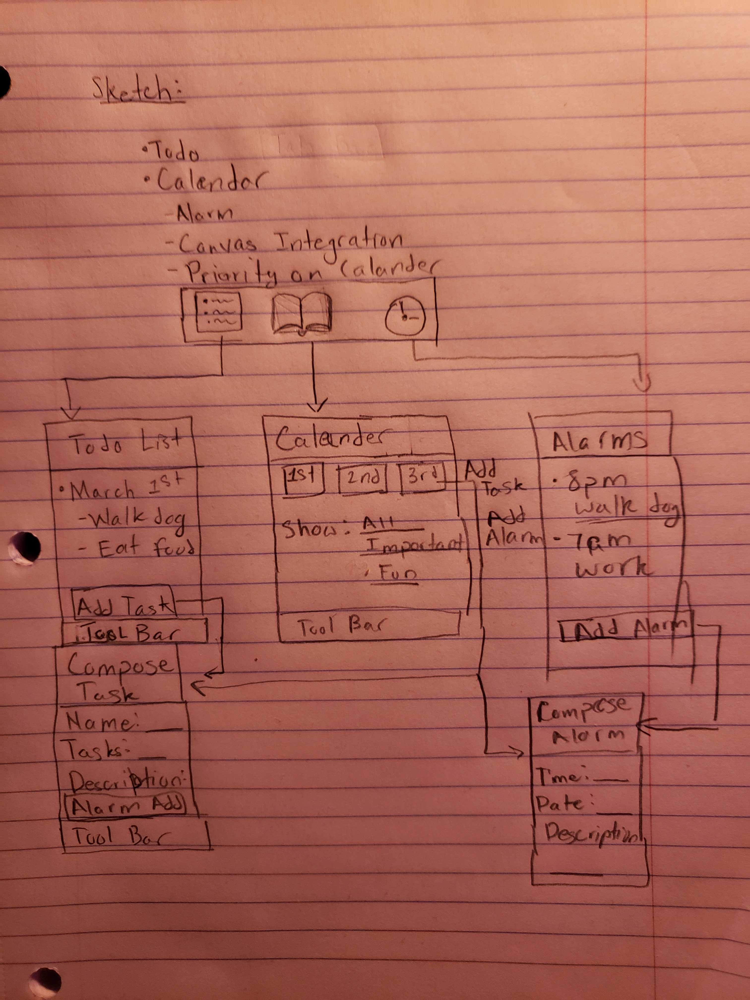

# Calendify
# Group 27 Mobile App Development Document    

## Table of Contents
1. [Overview](#Overview)
2. [Product Spec](#Product-Spec)
3. [Wireframes](#Wireframes)
4. [Schema](#Schema)

## Overview

## Sprint Week 2 (Unit 11) Update

User Stories

- [X]  Unique UI design with icon and splashScreen
- [X]  User must be able to create a to-do and event items and set item name, time, alarm
- [X]  User must be able to see relevant to-do items in a list
- [X]  User must be able to edit and remove items from the list of task
- [X]  User receives a notification at a designated time
- [X]  User is able to set alarms/reminders
- [X]  Reminders activate at the given time notifying the user
- [X]  Synch between task and reminder creation

Here's an update on our Unit 11 progress: 

  

GIF created with [LiceCap](https://www.cockos.com/licecap/).

### Description
Our app allows users to create events and to-do items that can be organized on a calendar and to-do list. Each event and to-do allows users to set the details, such as date, time, and other details. Users can evenset alarms to notify them of things that are coming up.

### App Evaluation
- **Category:** Productivity
- **Mobile:** Mobile is essential for users to easily create new events and to-do items. The system alarm can be used with the events and tasks that are created.
- **Story:** Creates a system for any users seeking to improve productivity to stay on track and build good habits.
- **Market:** Anyone who looks to improve their productivity and habits. The app provides a way for people to organize their life. Our target could directly be for students.
- **Habit:** Users would use the app daily in order to stay on track with assignments, meetings, and other important tasks.
- **Scope:** V1 would allow users to create events and to-dos that can be edited/completed. V2 would incorporate setting the alarm for events that would notify users.

## Product Spec

### 1. User Stories (Required and Optional)

**Required Must-have Stories**

* User must be able to create a to-do and event items and set item name, time, alarm
* User must be able to see relevant to-do items in a list
* User must be able to edit and remove items from the list
* Reminders activate at the given time notifying the user
* User is able to adjust alarms, reminders through a settings page

**Optional Nice-to-have Stories**

* User can import other calendars via .ics files (for Canvas, Outlook, Google Calendar support)
* User is able to customize the app with color options
* User is able to add labels to to-do/event items
* User is able to add descriptions to alarms and to-do items. 
* User can see upcoming schedule via a widget for the lockscreen

### 2. Screen Archetypes

* To-Do List Screen
   * User can view all upcoming events and to-doo items
   * User can tap a "plus/add" button in order to add a to-do item
   * Display the additional information on the task creation screen
* To-Do/Event Creation Screen
    * User can set/edit event/to-do item, classify item, and set an alarm 
* Settings Screen
    * User can adjust alarm settings, like how many minutes/hours before, alarm sound, alarm sound choice

### 3. Navigation

**Tab Navigation** (Tab to Screen)

* Reminders
* To-do List

**Flow Navigation** (Screen to Screen)

* Reminder
   * Create reminder
   * Set date
   * Set time
   * Add description
* To-do List
   * Create tasks
   * Check off tasks
   * Delete and edit tasks
* Create Event/To-do
   * Date
   * Time
   * Alarm setting
* Alarm
   * Scroll (hour, minute, AM/PM)
* Settings
    * Change settings

## Wireframes

### [BONUS] Digital Wireframes & Mockups

### [BONUS] Interactive Prototype

## Schema 
### Models
To-Do Object
| Property      | Type | Description |
| ----------- | ----------- | ------------ |
| Name | String  | Name of the to-do item. |
| Description | String | Additional details about the to-do item. |
| Date | String | The calendar date that this to-do item is supposed to happen. |
|Time |Java.time Object | The time at which this to-do item will begin. |
|Status | boolean | Whether or not the to-do item has been completed. |
|HasAlarm | boolean | Whether the user has designated an alarm for this to-do item or not. |
|MinutesBefore | number | How many minutes before the to-do item an alarm is supposed to go off. |

Event
|Property |Type |Description|
|---|---|---|
|Name | String | Name of the event|
|Location | String | Where the event is occuring. |
|Description | String | Additional information about the event.|
|Date| String | When the event(s) is supposed to occur. |
|Time | Java.Time| When the event will occur. |
|Recurrence | String | Which days of the week this event will occur on.|
|HasAlarm | boolean | Whether the user has designated an alarm for this event or not. |
|MinutesBefore | number | How many minutes before the event an alarm is supposed to go off. |

Alarm 
|Property |Type |Description|
|---|---|---|
|Name | String | The name of the alarm. |
|Time | Java.time | When the alarm should go off. |
|Recurrence | String | Which days of the week the alarm should ring. |

### Networking
* Calendar Screen
  * (Read/GET) All events within the given month
  * (Create/POST) Creating a new event/to-do item
 * To-do/Event View 
    * (Read/GET) All upcoming events/to-do items
    * (Create/POST) Creating an event/to-do item
    * (Delete) Delete an event/to-do item
 * Alarm Screen
    * (Read/GET) All upcoming alarms
    * (Create/POST) Creating an alarm with its recurrence
    * (Delete) Delete an alarm
